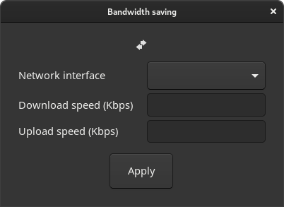
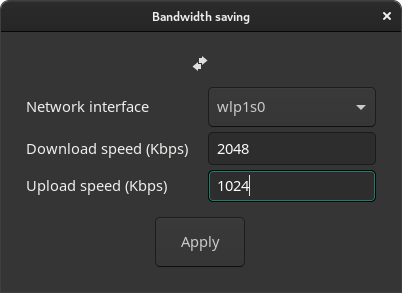

# Bandwidth Saving
Saver your data.

## How it works?
This is a GUI application to generate and run `wandershaper` config file.

## How to use?
> TO USE IT, YOU **NEED** `wondershaper` INSTALLED SCRIPT INSTALLED.

To compile, you'll need the `cargo` tool installed.
### Build 
```sh
make build
```

### Run 
```sh
make run 
```

## Interface

### Interface clean


### Interface filled 
